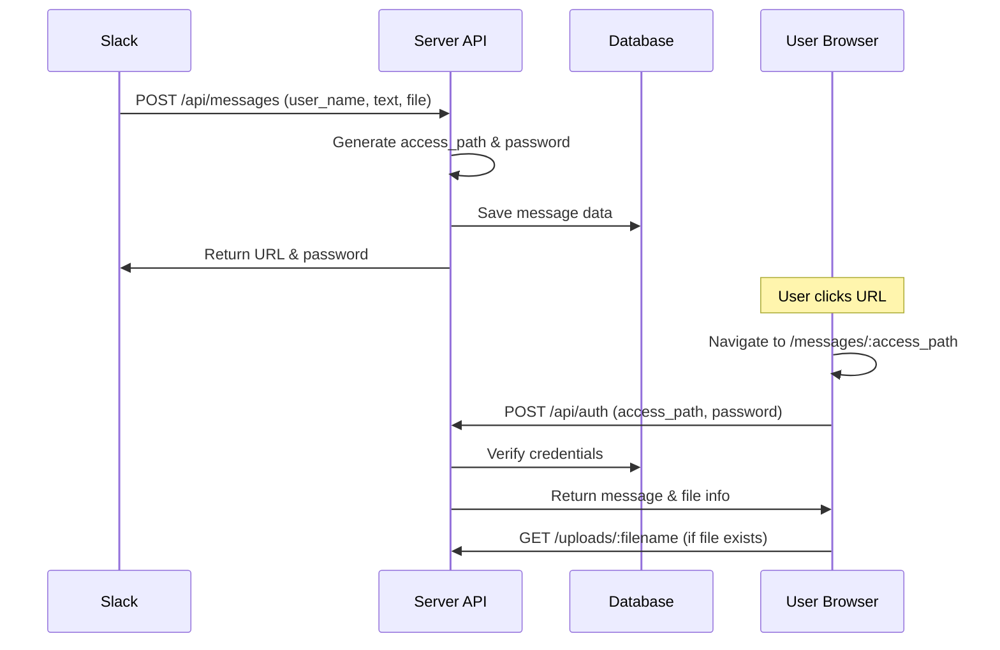

# Slack Secure Message

Slackコマンドでセキュアなメッセージとファイルを送信できるシステムです。

## 📋 概要

このシステムは以下の機能を提供します：
- Slackコマンドでセキュアメッセージの作成
- ランダム生成されたURLとパスワードによる認証
- ファイルアップロード機能
- セキュアなメッセージ表示

## 🏗️ システム構成

```
slack-secure-message/
├── server/                 # バックエンド (Node.js + Express)
│   ├── index.js           # メインサーバーファイル
│   ├── database.db        # SQLiteデータベース
│   ├── uploads/           # アップロードファイル格納
│   └── package.json       # 依存関係
└── client/                # フロントエンド (React)
    ├── src/
    │   ├── App.js         # メインアプリケーション
    │   ├── index.js       # エントリーポイント
    │   └── pages/
    │       └── MessagePage.js  # メッセージ表示ページ
    └── package.json       # 依存関係
```

## 🛠️ 技術スタック

### バックエンド
- **Node.js** - サーバー実行環境
- **Express.js** - Webアプリケーションフレームワーク
- **SQLite3** - データベース
- **multer** - ファイルアップロード処理
- **crypto** - セキュアな乱数生成
- **cors** - クロスオリジンリクエスト対応

### フロントエンド
- **React** - UIライブラリ
- **React Router** - ルーティング
- **Fetch API** - HTTP通信

## 📝 APIエンドポイント

### POST `/api/messages`
Slackコマンドからメッセージを作成
- **入力**: `user_name`, `text`, `file`（オプション）
- **出力**: URLとパスワード

### POST `/api/auth`
パスワード認証してメッセージを取得
- **入力**: `access_path`, `password_plain`
- **出力**: メッセージ内容とファイル情報

### GET `/uploads/:filename`
アップロードされたファイルを配信

## 🚀 セットアップ

### 1. 依存関係のインストール

```bash
# サーバー側
cd server
npm install express sqlite3 cors multer

# クライアント側
cd ../client
npm install react react-dom react-router-dom
```

### 2. サーバー起動

```bash
cd server
node index.js
```

サーバーは `http://localhost:3001` で起動します。

### 3. クライアント起動

```bash
cd client
npm start
```

クライアントは `http://localhost:3000` で起動します。

## 🔄 システムフロー



## 🔒 セキュリティ機能

- **ランダムURL生成**: `crypto.randomBytes(8)` で16文字のランダム文字列
- **ランダムパスワード**: `crypto.randomBytes(4)` で8文字のランダム文字列
- **ファイルアップロード制限**: multerでファイルサイズ・タイプ制限
- **CORS設定**: クロスオリジンリクエスト制御

## 📊 データベース構造

```sql
CREATE TABLE secure_messages (
    id INTEGER PRIMARY KEY AUTOINCREMENT,
    recipient_id TEXT,
    message_content TEXT,
    access_path TEXT UNIQUE,
    password_plain TEXT,
    file_path TEXT,
    created_at DATETIME DEFAULT CURRENT_TIMESTAMP
);
```

## 🎯 使用方法

### 1. Slackコマンドでメッセージ作成
```
/secure メッセージ内容
```

### 2. システムがURLとパスワードを生成
```
メッセージを作成しました！
URL: http://localhost:3000/messages/a1b2c3d4e5f6g7h8
Password: x1y2z3w4
```

### 3. 受信者がURLにアクセス
- URLをクリック
- パスワードを入力
- メッセージとファイル（あれば）を表示

## ⚠️ 現在の制限事項

- 送信者と受信者が同一人物になる設計
- Slack Web APIとの連携が未実装
- ファイルの永続的な保存
- メッセージの有効期限なし

## 🔧 今後の改善予定

- [ ] 受信者指定機能（`@user`メンション対応）
- [ ] Slack Web APIでDM自動送信
- [ ] メッセージ自動削除機能
- [ ] ファイルタイプ制限の強化
- [ ] UI/UXの改善

## 📞 サポート

問題や質問がある場合